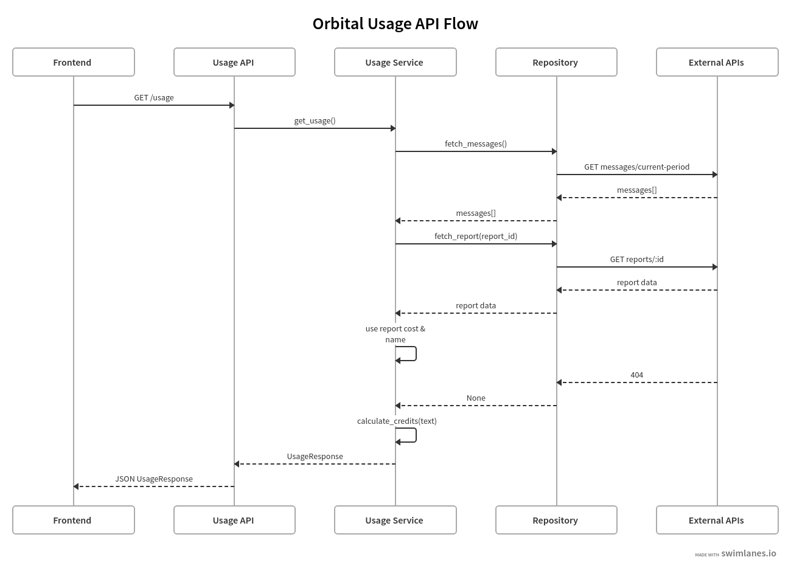
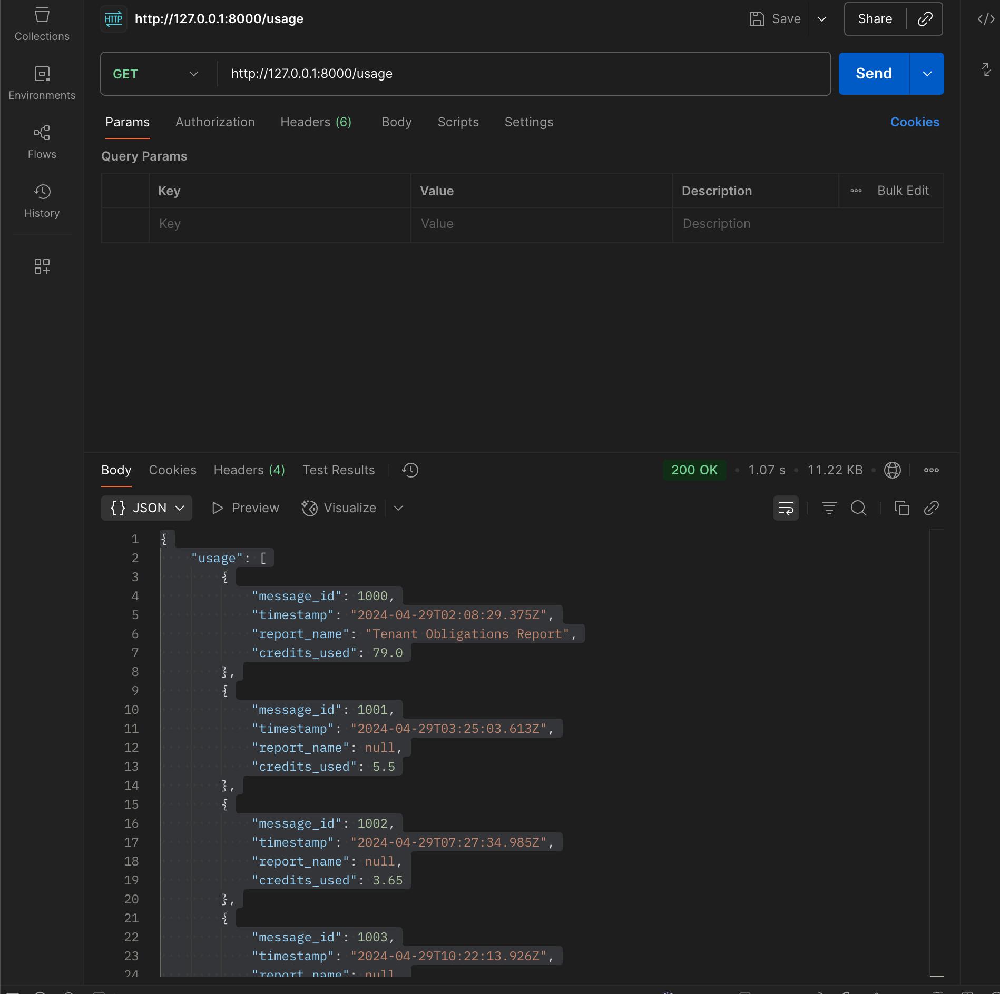
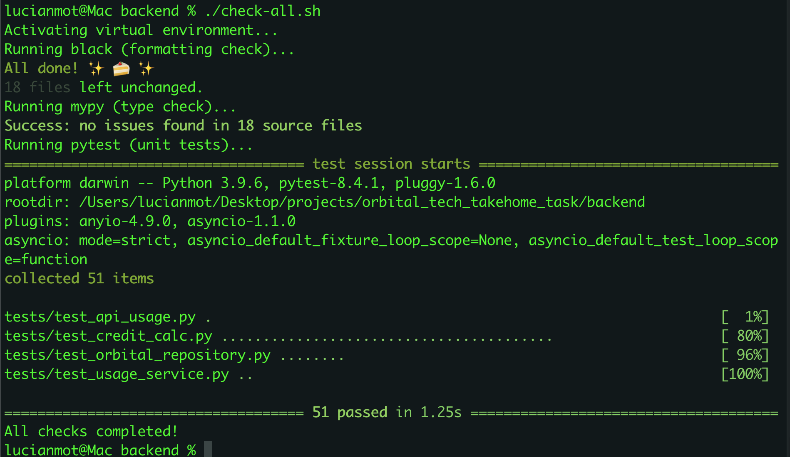
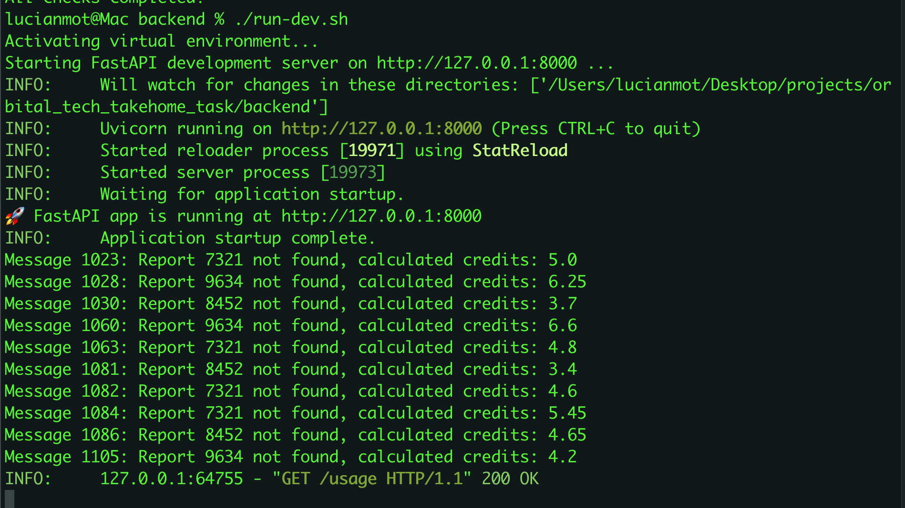
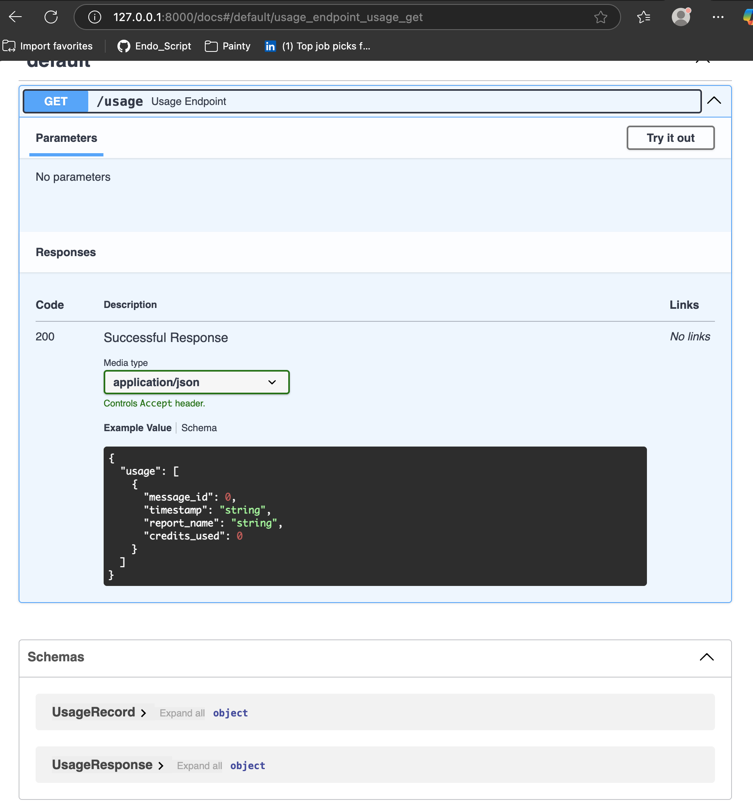

# Backend Setup & Usage

## Architecture Overview

This backend is structured in clear layers for maintainability and scalability:

- **Usage API** (FastAPI controller/router): Handles `/usage` endpoint API responses.
- **Usage Service**: Orchestrates fetching message data, report data, and running all calculation/business rules.
- **Repository Layer**: Fetches raw message and report data from the external Orbital APIs.
- **External APIs**: Third-party endpoints providing message and report details.

For a detailed sequence of how a `/usage` request is processed, see the swimlane diagram below:

  
*(Update this link with your actual diagram URL if different!)*

The diagram shows how the API, service, and repository layers interact to serve accurate and contract-correct usage data to clients.

---

## 1. Installation

Navigate to the backend directory:

```bash
cd backend
```

Create and activate your virtual environment (if you haven’t already):

```bash
python3 -m venv venv
source venv/bin/activate
```

Install all required dependencies:

```bash
pip install -r requirements.txt
```

---

## 2. Running the Backend Server

Use the provided script to activate your environment and start the FastAPI server:

```bash
./run-dev.sh
```

This will launch the API at [http://127.0.0.1:8000](http://127.0.0.1:8000).  
You can also access interactive docs at [http://127.0.0.1:8000/docs](http://127.0.0.1:8000/docs).

---

## 3. Running All Tests and Checks

Use the provided script to check formatting, type safety, and run all tests:

```bash
./check-all.sh
```

This will:
- Run **black** (formatting check)
- Run **mypy** (type checking)
- Run **pytest** (unit, integration, and API tests)

---

## 4. Notes

- All code is strict-type checked (mypy), auto-formatted (black), and tested (pytest).
- If you encounter issues, ensure your virtual environment is activated and all dependencies are installed.

---

## Developer Verification & Testing

Below are screenshots that demonstrate the development and testing process for this backend:

### 1. Endpoint verification in Postman



### 2. Running server logs (development)



### 3. All tests passing (black, mypy, pytest)



### 4. OpenAPI docs generated from FastAPI (Swagger)



---

*These images serve as proof of local correctness, testing, and contract accuracy.*