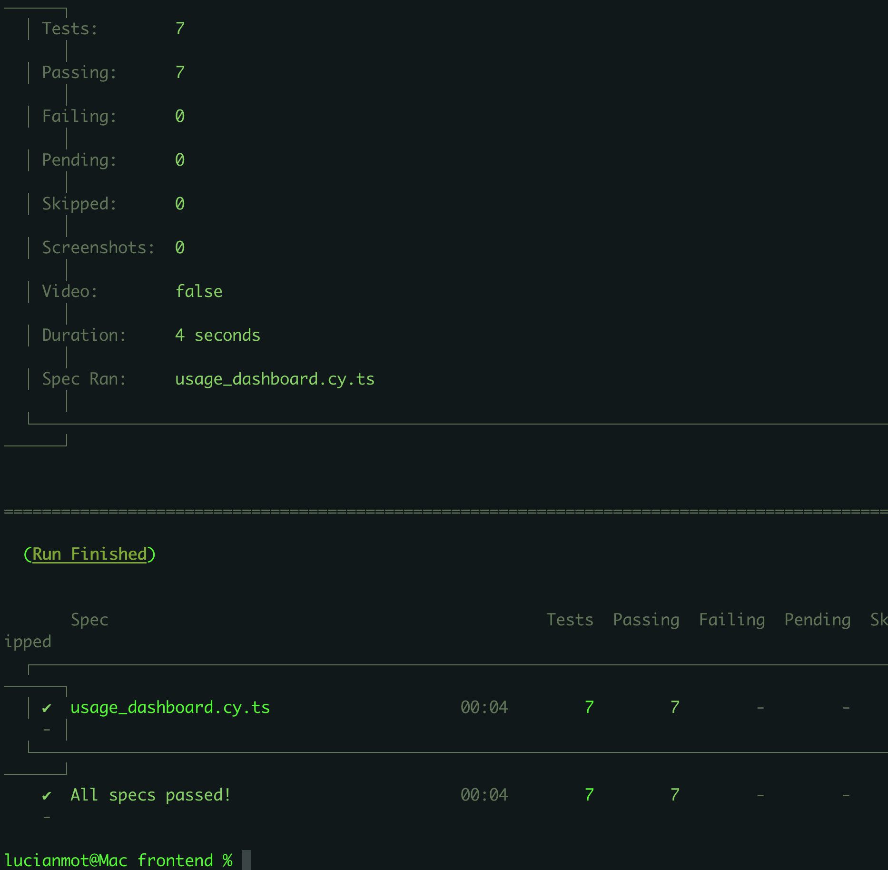
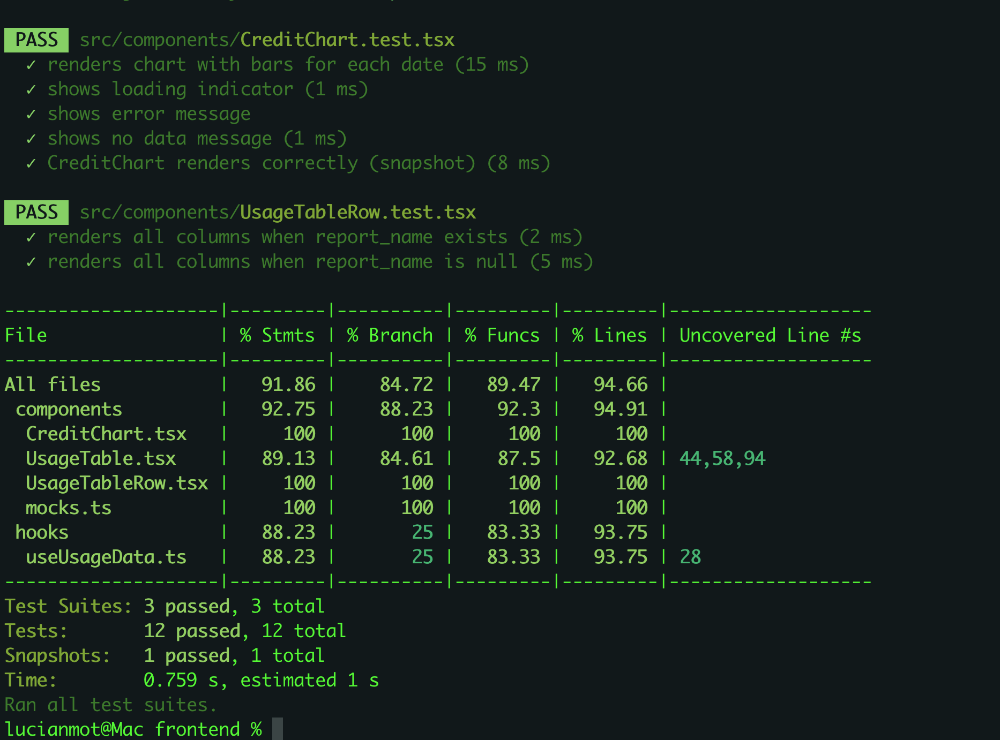
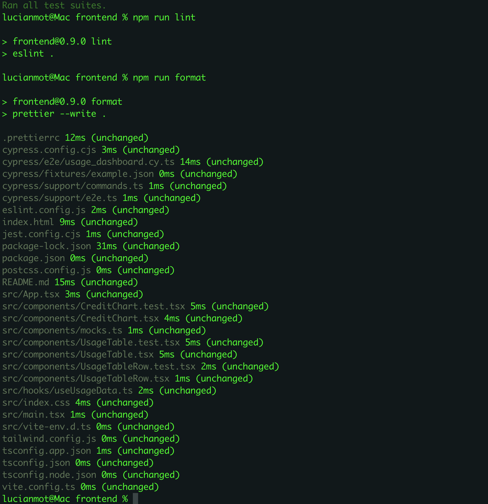
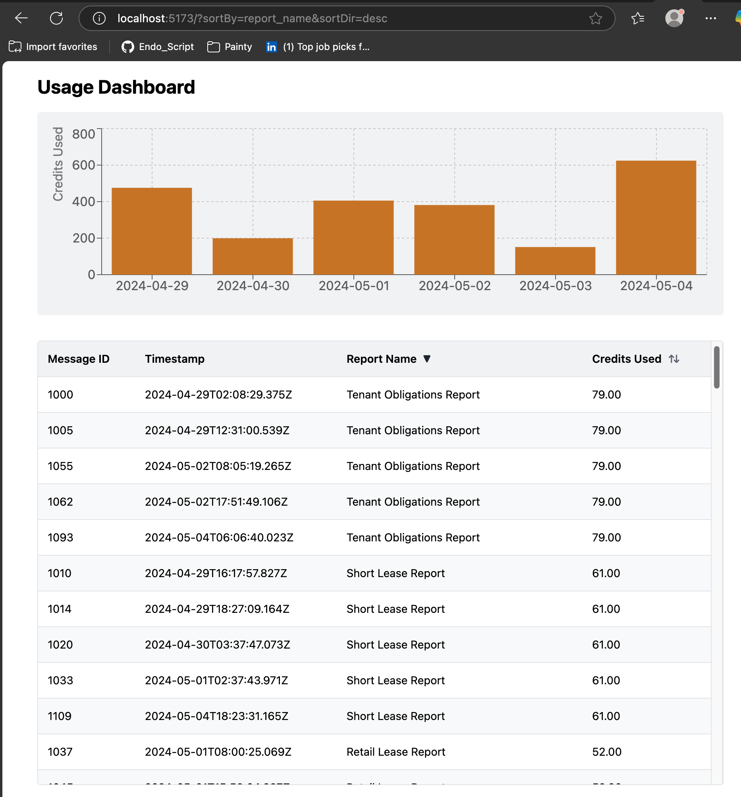

# Orbital Tech Frontend

A modern, maintainable dashboard UI for Orbital Copilot’s usage reporting system.

---

## 🚀 Tech Stack

- **Vite** (build tool / dev server)
- **React 19 + TypeScript**
- **React Router 7** (client-side routing & URL sync)
- **Tailwind CSS** (utility-first styling)
- **Recharts** (bar chart visualizations)
- **Jest** + **@testing-library/react** (unit & integration testing)
- **ESLint**, **Prettier** (code quality & formatting)

---

## 🛠️ Setup & Installation

1. **Install dependencies:**

   ```bash
   npm install
   ```

2. **Start the development server:**
   ```bash
   npm run dev
   ```
   Visit [http://localhost:5173/](http://localhost:5173/) in your browser.

---

## 🧪 Development & Testing Commands

| Command           | What it does                                      |
| ----------------- | ------------------------------------------------- |
| `npm run dev`     | Start Vite dev server (hot reload, local preview) |
| `npm run build`   | Type-check, then build for production             |
| `npm run preview` | Preview built production app                      |
| `npm run test`    | Run all Jest/RTL tests (with coverage)            |
| `npm run lint`    | Lint all source files with ESLint                 |
| `npm run format`  | Format all files with Prettier                    |

---

## 💡 Approach

- **Component-driven**: UI split into logical, reusable components (`UsageTable`, `CreditChart`, etc.).
- **Type-safe**: All code is written in TypeScript for safety and clarity.
- **Modern best practices**:
  - State management via React hooks.
  - URL query params for sort/filter state (fully test-covered).
  - All core logic (data fetching, sorting, filtering) is tested.
  - Clean separation between UI, hooks, and mock data for fast dev/testing.
- **Fast feedback**: All dev tools and code quality tools are set up from day one.
- **Style**: Tailwind is used for simple, modern, and responsive design.

---

## 🤝 Backend Integration

- Expects a compatible backend API running at `/usage` (see project root README for more).
- To develop locally, ensure the backend is running (default: [http://localhost:8000/usage](http://localhost:8000/usage)).

---

## 🧑‍💻 Contributing

- PRs should include relevant tests and pass all linters.
- Please keep code type-safe and use Prettier before submitting.

---

## 📁 Project structure (highlights)

```
frontend/
  src/
    components/        # React UI components
    hooks/             # Custom React hooks (data fetching, state)
    index.css          # Tailwind base/imports
    App.tsx
    main.tsx
  package.json
  tailwind.config.js
  vite.config.ts
```

---

## 🧪 Quality Gates & Dev Workflow

Below are real screenshots from the current dev setup, showing the end-to-end quality process for Orbital Copilot’s frontend:

### 1. **E2E Test Results**  
Full dashboard flow tested with **Cypress** (`frontend/screenshots/e2e_test.png`):



---

### 2. **Jest Unit, Integration & Snapshot Coverage**  
React components and hooks have strong Jest/RTL + snapshot test coverage (`frontend/screenshots/tests_snapshot_tests.png`):



---

### 3. **Linting & Formatting**  
Codebase passes **ESLint** (strict) and **Prettier** (auto-formatting) checks (`frontend/screenshots/eslint_prettier.png`):



---

### 4. **App Running in Dev Mode**  
Example of the live dashboard running locally (`frontend/screenshots/app_running.png`):



---

## 📌 TODOs

- [ ] Polish visual style & handle all edge cases in sorting/filtering.
- [ ] Add more e2e scenarios (accessibility, mobile, etc).
- [ ] Refactor and document remaining UI logic as time allows.

---
